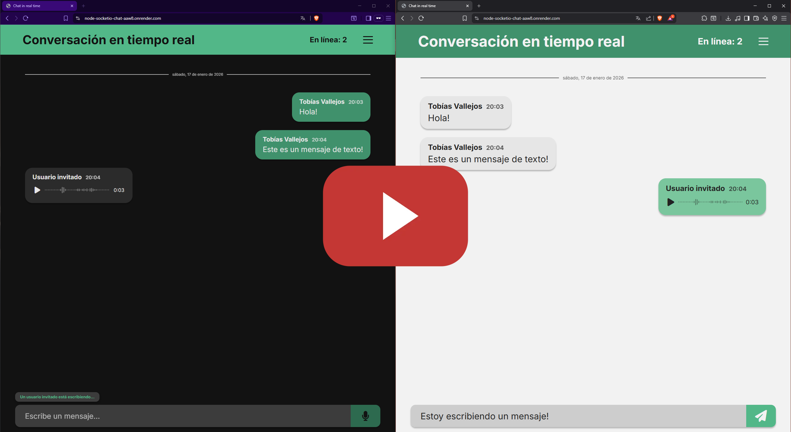
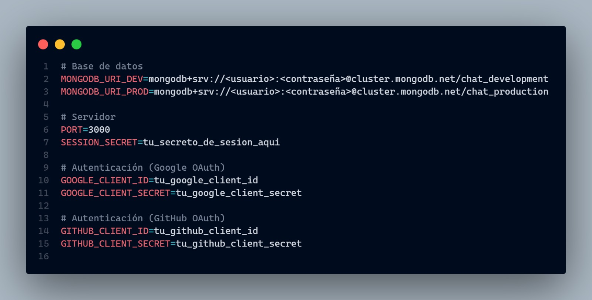

# 💬 Chat en Tiempo Real

> Aplicación de chat en tiempo real construida con **JavaScript Vanilla**, **Socket.IO**, **Node.js**, **Express** y **MongoDB**. Incluye autenticación OAuth (Google/GitHub), mensajes de audio con visualización de forma de onda, y modo oscuro/claro.

<br>

## 🎥 Demostración

La aplicación se encuentra [desplegada en producción](https://node-socketio-chat-aaw8.onrender.com) y la siguiente demostración fue grabada sobre la versión activa.

[](https://youtu.be/dyyySLptN5Y "Ver en YouTube")

> [!NOTE]  
> La demostración completa con audio y modo oscuro está disponible en el video.

<br>

## 🧠 Filosofía del Proyecto

En un mundo dominado por **React** y **Next.js**, es fácil olvidar cómo funciona la web por detrás. Por eso desarrollé esta aplicación utilizando **JavaScript Vanilla**.

El objetivo fue explorar el diseño de una arquitectura de software utilizando únicamente estándares web nativos. Esto implicó implementar patrones de diseño clásicos como **Singleton**, **Facade** y **Observer**. En lugar de depender de la gestión de estado de un framework, diseñé una estructura modular escalable que orquesta el ciclo de vida del DOM, la comunicación vía **WebSockets** y el procesamiento de audio en tiempo real.

Quería enfrentarme a los problemas que las librerías modernas nos resuelven 'mágicamente', tales como la **sincronización del estado**, la **eficiencia del renderizado** y el **manejo de flujos de datos complejos**. Al hacerlo, transformé la teoría en experiencia práctica.

<br>

## 🎯 Público Objetivo

- Desarrolladores que quieran entender WebSockets sin frameworks
- Estudiantes de arquitectura de software
- Proyectos educativos y demostrativos

<br>

## ✨ Características

### 🔐 Seguridad y Sistema

- Chat en tiempo real con WebSockets (Socket.IO)
- Autenticación con Google y GitHub (OAuth)
- Modo invitado para acceso rápido
- Control de frecuencia y protección Anti-Spam (Rate Limiting)
- Detección de sesiones duplicadas
- Historial de mensajes persistente

### 🎨 Experiencia de Usuario (UX)

- Visualización de forma de onda para mensajes de audio
- Indicadores de escritura en tiempo real
- Contador de usuarios en línea
- Tema claro/oscuro con modo automático
- Soporte multiidioma (Español/Inglés)
- Diseño responsivo para móviles y escritorio

### 🧩 Detalles

- Mensajes de texto y audio
- Notificaciones de sonido
- Separadores de fecha automáticos

<br>

## 🛠️ Tecnologías Utilizadas

| Categoría | Tecnologías y Propósito |
| :--- | :--- |
| **Frontend (Cliente)** | [**HTML5**](https://developer.mozilla.org/es/docs/Web/HTML) & [**CSS3**](https://developer.mozilla.org/es/docs/Web/CSS) (Variables, Flexbox) <br> [**JavaScript Vanilla (ES6+)**](https://developer.mozilla.org/es/docs/Web/JavaScript) - Manipulación directa del DOM y gestión de eventos. |
| **Tiempo Real** | [**Socket.IO**](https://socket.io/) (Client & Server) - Comunicación bidireccional basada en eventos. |
| **Multimedia (Nativo)** | [**Web Audio API**](https://developer.mozilla.org/es/docs/Web/API/Web_Audio_API) - Análisis de frecuencias (FFT) para visualización de ondas. <br> [**MediaStream API**](https://developer.mozilla.org/es/docs/Web/API/Media_Streams_API) - Captura de flujo de audio del micrófono. |
| **Backend (Servidor)** | [**Node.js**](https://nodejs.org/) & [**Express**](https://expressjs.com/) - Entorno de ejecución de JavaScript y framework para servidor HTTP. |
| **Base de Datos** | [**MongoDB**](https://www.mongodb.com/) & [**Mongoose**](https://mongoosejs.com/) - Modelado de esquemas y persistencia de datos. |
| **Seguridad** | [**Passport.js**](https://www.passportjs.org/) - Estrategias de autenticación OAuth 2.0. <br> [**Helmet**](https://www.npmjs.com/package/helmet) - Protección de cabeceras HTTP. <br> [**Express-Rate-Limit**](https://www.npmjs.com/package/express-rate-limit) - Prevención de ataques de fuerza bruta. |

<br>

## 📁 Estructura del Proyecto

```
├── assets/                    # Recursos estáticos (Imágenes, íconos, multimedia)
│
├── client/                    # Cliente (Frontend)
│   ├── css/                   # Estilos organizados por arquitectura modular
│   │   ├── base/              # Reset, variables, tipografía
│   │   ├── components/        # Componentes UI (Mensajes, inputs, loader)
│   │   ├── modals/            # Ventanas modales
│   │   ├── utilities/         # Clases de utilidad
│   │   └── main.css           # Punto de entrada de estilos
│   │
│   ├── js/                    # Lógica de la aplicación (Vanilla JavaScript)
│   │   ├── audio/             # API Web Audio, grabación y visualización
│   │   ├── auth/              # Gestión de autenticación y sesiones
│   │   ├── chat/              # Lógica de WebSockets e input de usuario
│   │   ├── message/           # Renderizado y manipulación del DOM de mensajes
│   │   ├── notifications/     # Sistema de notificaciones
│   │   ├── settings/          # Configuración de usuario
│   │   ├── sockets/           # Cliente Socket.IO (Singleton)
│   │   ├── theme/             # Lógica de cambio de tema (Claro/Oscuro)
│   │   ├── translations/      # Internacionalización (i18n)
│   │   ├── utils/             # Utilidades generales
│   │   ├── chat.js            # Inicializador del chat
│   │   └── flow-manager.js    # Orquestador de vistas (Login/Chat)
│   │
│   └── index.html             # Punto de entrada HTML
│
├── server/                    # Servidor (Backend)
│   ├── src/
│   │   ├── config/            # Configuración (Env, Passport, Session, CORS)
│   │   ├── controllers/       # Controladores de rutas
│   │   ├── database/          # Conexión a MongoDB
│   │   ├── middlewares/       # Middlewares (Rate Limit, Auth Check)
│   │   ├── models/            # Modelos de Mongoose (User, Message)
│   │   ├── routes/            # Rutas de la API (Express Router)
│   │   ├── services/          # Lógica de negocio
│   │   ├── sockets/           # Manejadores de eventos de Socket.IO
│   │   │   ├── handlers/      # Lógica por tipo de evento
│   │   │   ├── store/         # Almacenamiento de sesiones en memoria
│   │   │   └── index.js       # Inicializador de Sockets
│   │   ├── utils/             # Validaciones y seguridad
│   │   ├── app.js             # Configuración de la App Express
│   │   └── index.js           # Punto de entrada del servidor
│   │
│   └── package.json           # Dependencias y scripts
```

<br>

## 💻 Instalación y Configuración

### 1️⃣ Prerrequisitos:
- **[Node.js](https://nodejs.org/)** (Versión 18+) 
- **[MongoDB Atlas](https://www.mongodb.com/products/platform/atlas-database)**
  - Alternativamente: **[MongoDB Local](https://www.mongodb.com/)** (Versión 5+)
- Cuenta de **[Google](https://console.cloud.google.com/apis/credentials)** y/o **[GitHub](https://github.com/settings/developers)** (Necesario para configurar las credenciales OAuth)

### 2️⃣ Clonar el repositorio:
```bash
git clone https://github.com/tu-usuario/node-socketio-chat.git
cd node-socketio-chat
```

### 3️⃣ Instalar dependencias:
```bash
cd server
npm install
```

### 4️⃣ Configurar variables de entorno:
- Dentro de `server`, renombrar el archivo `.env.example` a `.env`
- Abrir el archivo `.env` y reemplazar los valores de ejemplo con tus credenciales:



> [!TIP]  
> Para obtener las credenciales OAuth:
> - **Google:** [Google Cloud Console](https://console.cloud.google.com/apis/credentials)
> 
> - **Github:** [GitHub Developer Settings](https://github.com/settings/developers) 

### 5️⃣ Iniciar el servidor:
Desde la carpeta `server`:

```bash
# Modo desarrollo
npm run dev

# Modo producción
npm start
```

<br>

## 🚀 Futuras Mejoras

### 🏗️ Arquitectura e Infraestructura

- [ ] **Migración a React:** Refactorización completa del cliente para adoptar una arquitectura basada en componentes y Virtual DOM.

- [ ] **Almacenamiento en la nube:** Integración con AWS S3 o Cloudflare R2 para la gestión escalable de archivos multimedia y reducción de carga en base de datos.

- [ ] **Búsqueda Full-Text:** Implementación de un motor de búsqueda indexado para recuperar mensajes históricos eficientemente.

### 👥 Experiencia de Usuario (Social)

- [ ] **Sistema de reacciones:** Interacción rápida mediante emojis sobre mensajes específicos.

- [ ] **Identidad de usuario:** Personalización avanzada de perfiles (avatares, biografía y estado).

- [ ] **Menciones y notificaciones:** Sistema de etiquetado (@usuario) con alertas directas.

### 📡 Comunicación Avanzada

- [ ] **Mensajería privada (DMs):** Implementación de canales directos 1:1 encriptados entre usuarios.

- [ ] **Gestión de salas:** Creación de canales privados y grupos temáticos con control de acceso.

- [ ] **Soporte multimedia:** Capacidad para compartir imágenes, documentos y archivos adjuntos.

- [ ] **Mutabilidad de mensajes:** Funcionalidad para la edición de contenido y eliminado lógico (soft-delete) de mensajes propios.

### 🛡️ Administración

- [ ] **Panel de moderación:** Herramientas para reportar usuarios y gestionar contenido inapropiado.

<br>

## 📄 Licencia

Este proyecto está bajo la **Licencia MIT**. Consulta el archivo [LICENSE](LICENSE) para más detalles.

<br>

## 👤 Autor

**Tobías Vallejos** - Desarrollador Full Stack

- **GitHub: [@TochuGV](https://github.com/TochuGV)**
- **LinkedIn: [Tobías Vallejos](https://www.linkedin.com/in/tobiasvallejos/)**